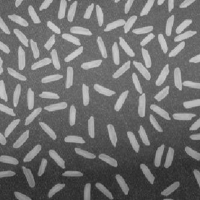
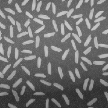
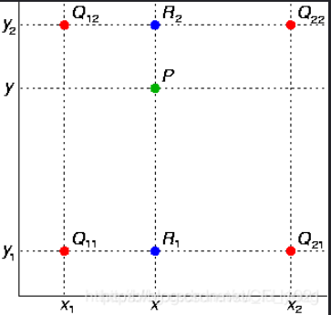
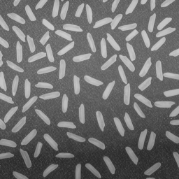
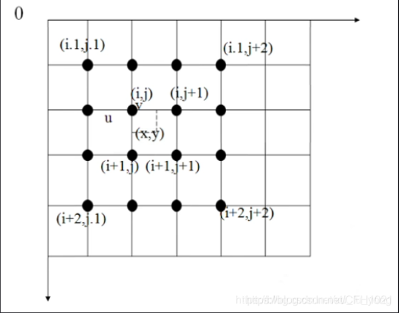
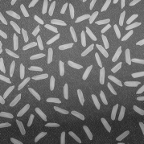

<h1 align = "center">Lab2 Image Interpolation</h1>

<center>张旭东 12011923</center>

## 1. introduction

​	As an important technology in digital image processing, image interpolation algorithm is widely used in military radar image, satellite remote sensing image, astronomical observation image, geological exploration data image, biomedical section, fiber image and network transmission image and other special image and daily character scene image processing. The purpose of this lab is to design three algorithms to realize image interpolation, including nearest neighbor interpolation, bilinear interpolation and bicubic interpolation. The principle of image interpolation is to find the position of the target pixel in the source image according to the zooming relation, and get the value of the target pixel according to the relevant interpolation rules. The three algorithms have their own advantages and disadvantages in computing performance and effect. 


<div align = 'center'><b>Fig.1 the principle of nearest neighbor interpolation,linear interpolation,cubic interpolation and their forms in 2D</div>

## 2. Result and analysis

### 2.1 nearest  neighbor interpolation

​	Nearest neighbor interpolation is the simplest algorithm of image interpolation, which is also called zero-order interpolation method. The principle of it is to find the point closest to the  position of the target pixel in the source image according to the zooming relation and take the gray value of the point as the pixel value of the target pixel.


<div align = 'center'><b>Fig.2 the principle of nearest neighbor interpolation in 2D</div>

​	The algorithm that maps a target pixel point to a position in the source image is as below:

​	
$$
scrx=tagx×\frac{scrH}{tagH}\\
scry=tagy×\frac{scrW}{tagW}\\
$$
​	The pseudo code for nearest interpolation in $2D$ is as shown below:

```python
scrH,scrW⬅sourceimage.shape
for x,y in targetimage
	correspondingX⬅round(x*((scrH-1)/(tagH-1)))
    correspondingY⬅round(y*((scrW-1)/(tagW-1)))
    targetimage[x,y]=sourceimage[correspondingX,correspondingY]
```

​	Because the index in `python` starts at $0$, the expressions exist $-1$.

​	The code is as shown as below:

```python
def NN_interpolation(img,dim): #dim is a 1×2 vector, representing the height and weight of interpolation
    scrH,scrW=img.shape
    retimg=np.zeros((dim[0],dim[1]),dtype=np.uint8)
    for i in range(dim[0]):
        for j in range(dim[1]):
            scrx=round(i*((scrH-1)/(dim[0]-1)))
            scry=round(j*((scrW-1)/(dim[1]-1)))
            retimg[i,j]=img[scrx,scry]
    return retimg
```

​	The results are as shown in `Fig.3` and `Fig.4`.



<div align = 'center'><b>Fig.3 enlarged image which zoom in to 1.3x</div>



<div align = 'center'><b>Fig.4 shrunk image which reduced to 0.7x</div>

​	Compared with the source pictures, it is obvious that the gray value of interpolated image have clear discontinuity. The quality of image is partially lost and there is sawtooth phenomenon.

### 2.2 bilinear interpolation

​	Bilinear interpolation, which is called one-order interpolation method, does interpolation three times to get final result. The principle of it is to find the  four points closest to the  position of the target pixel in the source image according to the zooming relation firstly, perform two linear interpolations in row direction, and perform one linear interpolations in column direction to get the final result. 



<div align = 'center'><b>Fig.5 the principle of bilinear interpolation in 2D</div>

​	$Q_{11}$, $Q_{12}$, $Q_{21}$ and $Q_{22}$ are the points in the source image while $P$ is the position of the target pixel in the source image according to the zooming relation. Assume the coordinate of $Q_{11}$, $Q_{12}$, $Q_{21}$, $Q_{22}$ and $P$ are $(x_{1},y_{1})$, $(x_{1},y_{2})$,$(x_{2},y_{1})$ and $(x_{2},y_{1})$ $(x_{2},y_{2})$. The calculation of gray value of $P$ is as `Formula 2`.
$$
f(R_{1})=\frac{x_{2}-x}{x_{2}-x_{1}}f(Q_{11})+\frac{x-x_{1}}{x_{2}-x_{1}}f(Q_{21})\\
f(R_{2})=\frac{x_{2}-x}{x_{2}-x_{1}}f(Q_{12})+\frac{x-x_{1}}{x_{2}-x_{1}}f(Q_{22})\\
f(P)=\frac{y_{2}-y}{y_{2}-y_{1}}f(R_{1})+\frac{y-y_{1}}{y_{2}-y_{1}}f(R_{2})
$$
​	However, there is a very important point needed to be considered, which is called geometric center alignment between the source image and target image. When using `Formula 1`, the target pixel will map back to the upper left corner of the original image. The reason is that the coordinates of image start at 0, resulting in the coordinates of the image's right boundary always being 1 less than the width. Because of that, the algorithm that maps a target pixel point to a position in the source image in bilinear interpolation is as `Formula 3`:
$$
scrx=(tagx+0.5)×\frac{scrH}{tagH}-0.5\\
scry=(tagy+0.5)×\frac{scrW}{tagW}-0.5\\
$$
​	We take 0.5 as the starting point of the coordinate system, subtract 0.5 from the mapping coordinates obtained according to the zooming relation, and get the mapping coordinates after the geometric center alignment. But once the geometric centers are aligned, the coordinate, $(0,0)$ in the target image maps back to the negative value in the source image when enlarging the source image. One optimization idea is to convert floating-point numbers to integers, which can solve this problem.  

​	The pseudo code for bilinear interpolation in $2D$ is as shown below:

```python
scrW,scrH⬅sourceimage.shape
scale_x,scale_y⬅float(scrW)/dim[1],float(scrH)/dim[0]

for x,y in targetimage
	mappingX⬅(x+0.5)*scale_x-0.5
    mappingY⬅(i+0.5)*scale_y-0.5
    src_x0⬅int(np.floor(src_x))#防止溢出0边界
    src_x1⬅min(src_x0+1,scrW-1)#防止溢出边界
    src_y0⬅int(np.floor(src_y))
    src_y1⬅min(src_y0+1,scrH-1)
    #根据公式计算像素值，对于四条边界上的点分别进行讨论
    temp0=(src_x1-src_x)/(src_x1-src_x0)*img[src_x0,src_y0]+(src_x-src_x0)/(src_x1-src_x0)*img[src_x1,src_y0]
                temp1=(src_x1-src_x)/(src_x1-src_x0)*img[src_x0,src_y1]+(src_x-src_x0)/(src_x1-src_x0)*img[src_x1,src_y1]
                targetimage[x,y]=(src_y1-src_y)/(src_y1-src_y0)*temp0+(src_y-src_y0)/(src_y1-src_y0)*temp1
    
   
```

​	The code is as shown as below:

```python
def BiLinear_interpolation(img,dim):#dim is a 1×2 vector, representing the height and weight of interpolation
    scrH,scrW=img.shape
    retimg=np.zeros((dim[0],dim[1]),dtype=np.uint8)
    scale_x=float(scrW)/dim[1]
    scale_y=float(scrH)/dim[0]
    
    for i in range(dim[0]):
        for j in range(dim[1]):
            #根据几何中心重合找出目标像素点映射回原像素的位置
            src_x=(j+0.5)*scale_x-0.5
            src_y=(i+0.5)*scale_y-0.5
            #找出最邻近的四个像素点
            src_x0=int(np.floor(src_x))#防止溢出0边界
            src_x1=min(src_x0+1,scrW-1)#防止溢出边界
            src_y0=int(np.floor(src_y))
            src_y1=min(src_y0+1,scrH-1)
            
            #代入公式计算
            if src_x1-src_x0==0 and src_y1-src_y0==0:
                retimg[j,i]=img[src_x0,src_y0]
            elif src_x1-src_x0==0:
                retimg[j,i]=(src_y1-src_y)/(src_y1-src_y0)*img[src_x0,src_y0]+(src_y-src_y0)/(src_y1-src_y0)*img[src_x0,src_y1]
            elif src_y1-src_y0==0:
                retimg[j,i]=(src_x1-src_x)/(src_x1-src_x0)*img[src_x0,src_y0]+(src_x-src_x0)/(src_x1-src_x0)*img[src_x1,src_y0]
            else:
                temp0=(src_x1-src_x)/(src_x1-src_x0)*img[src_x0,src_y0]+(src_x-src_x0)/(src_x1-src_x0)*img[src_x1,src_y0]
                temp1=(src_x1-src_x)/(src_x1-src_x0)*img[src_x0,src_y1]+(src_x-src_x0)/(src_x1-src_x0)*img[src_x1,src_y1]
                retimg[j,i]=(src_y1-src_y)/(src_y1-src_y0)*temp0+(src_y-src_y0)/(src_y1-src_y0)*temp1
    return retimg

```

​	The results are as shown in `Fig.6` and `Fig.7`.


<div align = 'center'><b>Fig.6 enlarged image which zoom in to 1.3x</div>



<div align = 'center'><b>Fig.7 shrunk image which reduced to 0.7x</div>

​	Compared with the results of nearest neighbor interpolation, it overcomes the discontinuity of gray value presented by the former, preserving the picture's quality at a large extent.

### 2.3 bicubic interpolation

​	Bicubic interpolation, which is called cubic convolution interpolation, not only takes the gray values of the surrounding 4 pixels into account, but also takes the influence of their gray value change rate into account. This algorithm uses the gray values of 16 pixel points near the mapping coordinate to do interpolation three times to get the gray values of target pixels. 



<div align = 'center'><b>Fig.8 the principle of bicubic interpolation in 2D</div>

​	The coordinates of  the position of the target pixel in the source image according to the zooming relation is $(x,y)$. The calculation of gray value of $(x,y)$ is as `Formula 4`.
$$
f(x,y)=   \left\{ \begin{array}{rcl}(a+2)|x|^{3}-(a+3)|x|^{2}+1 & |x| \leqslant 1 \\
 a|x|^{3}-5a|x|^{2}+8a|x|-4a & 1 <|x|  \leqslant 2\\
 0
 
 \end{array}\right.
$$
​	The pseudo code for bicubic interpolation in $2D$ is as shown below:

```python
output⬅np.zeros(dim)
scrH,scrW⬅img.shape
interpolator ⬅ interpolate.interp2d(range(scrH), range(scrW), img, kind='cubic')
tag_y ⬅ np.linspace(0, scrH - 1, num=tag_h)
tag_x ⬅ np.linspace(0, scrW - 1, num=tag_w)
retimg ⬅ interpolator(tag_y, tag_x)

```

​	The code is as shown as below:

```python
def Bicubic_interpolation(img,dim):#dim is a 1×2 vector, representing the height and weight of interpolation
    scrH,scrW=img.shape
    retimg=np.zeros((dim[0],dim[1]),dtype=np.uint8)
    tag_h, tag_w = int(dim[0]), int(dim[1])

    interpolator = interpolate.interp2d(range(scrH), range(scrW), img, kind='cubic')
    tag_y = np.linspace(0, scrH - 1, num=tag_h)
    tag_x = np.linspace(0, scrW - 1, num=tag_w)
    retimg = interpolator(tag_y, tag_x)
    return retimg

```

The results are as shown in `Fig.9` and `Fig.10`.


<div align = 'center'><b>Fig.9 enlarged image which zoom in to 1.3x</div>



<div align = 'center'><b>Fig.10 shrunk image which reduced to 0.7x</div>

​	Compared with the source image, the loss of image's quality is small and the effect is good. Compared with the result of bilinear interpolation, I can't tell which one is better just by looking at it. However, the effect of the latter is better through data research and algorithm analysis.

## 3. Conclusion

​	After this experiment and the reading of materials online, the advantages and disadvantages of the three interpolation algorithms are shown below.

|                           | nearest neighbor                                             | bilinear                                                     | bicubic                                                      |
| ------------------------- | ------------------------------------------------------------ | :----------------------------------------------------------- | ------------------------------------------------------------ |
| the mode of sample        | take the gray value of the point closest to the mapping point as the pixel value of the target pixel | find the  four points closest and do interpolation three times | uses the gray values of 16 pixel points near the mapping coordinate to do interpolation three times |
| computational performance | minimum computation, the fastest speed                       | the computation is relatively large and the speed is moderate | maximum computation, the slowest speed                       |
| effect                    | without considering the surrounding pixel points of the image, the gray value after sampling has obvious discontinuity, loss of image's quality is large, Mosaic or sawtooth phenomenon occur | The mutual influence of gray values of adjacent points is not considered, so it has the property of low-pass filtering. As a result, the high-frequency component of the scaled image is lost and the edge of the image becomes fuzzy | It can produce smoother edge than bilinear interpolation algorithm, and the accuracy of calculation is high. After processing, loss of the image's quality is the least and the effect is the best |

​	In a conclusion, which algorithm is selected according to the real simulation in the process of image interpolation. It is necessary to consider the feasibility of time and the availability of image's quality after interpolating, which can  achieve a more ideal result.