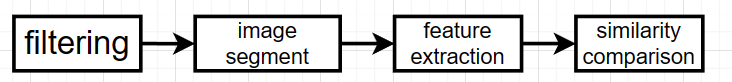

<h1 align = "center">Face matching based on similarity of image</h1>

<center>张旭东 12011923</center>

## 1.Introduction

​	Face matching technology is the process of comparing the face images detected in the static image or videos with the face images in the database to find out the matched faces, so as to achieve the purpose of identity recognition and identification. In real life, it is necessary to compare the similarity of different images or quickly find similar pictures from a large number of pictures, which requires the corresponding image similarity algorithm to achieve. In addition, most application scenarios of machine learning and artificial intelligence require the use of image similarity algorithms.

​	The methods used in face matching are histogram of oriented gradient and local binary pattern, which are both based on local similarity. Histogram of oriented gradient and local binary pattern are used for image segmentation to obtain feature vector of face by connecting various local feature vectors extracted from different positions in the face image in series. After getting feature vectors, the similarity between faces is compared by calculating the cosine distance between the feature vectors. The smaller the distance is, the higher the similarity is. 

​	Comparing the performance of the two methods with that of the perceptual hashing algorithm, it can be found that perceptual hashing algorithm that comes with the `opencv` library functions takes much less time than the two methods I have written myself. The time used by histogram of oriented gradient is less than that used by local binary pattern. For comparison of similarity, the similarity between two images of the same person calculated by local binary pattern is the highest. The second is that calculated by perceptual hashing algorithm and the last is that calculated by histogram of oriented gradient. 

## 2.Summarize

​	There are three classical algorithm of calculating similarity of images, including average hashing, differential hashing and perceptual hashing. The average hash algorithm is fast, but highly sensitive. A slight change will greatly affect the judgment results, resulting in poor accuracy. However, both average and differential hashing algorithms take less time than perceptual hashing. When the image's brightness, chroma, contrast and sharpness are changed, the performance of average hashing is the best, followed by that of difference hashing, and the worst is the performance of perceptual hashing. 

​	However, classical algorithm of calculating similarity of images to do face matching has some disadvantages. One of the disadvantages is that the noise is not taken into account. Due to the noise, sharpening convolution and similarity comparison of images directly will make the error rate of results relatively high. One method to improve is to add filtering for denoising before sharpening convolution. Another of the disadvantages is that it takes a long time to compare the similarity of the whole image. It's just the faces that need to be compared for similarity. So image segment is used after filtering and before feature extraction. 

## 3.Method



<div align = 'center'><b>Fig.1 processing flowchart of face matching based on comparison of images' similarity</div>

​	The processing flowchart[^Fig 1] is divided into four steps, including filtering, image segment, feature extraction and similarity comparison. 

### Filtering

​	The filter used to filtering is Bilateral filter[^1]. Bilateral filter is a nonlinear filtering method that combines spatial proximity and pixel value similarity of images as a compromise and considers spatial information and gray similarity, which can achieve edge preservation and denoising. It has the characteristics of simple, non-iterative and local. The advantage of bilateral filter is that it can make edge preserving, which is helpful for the next step-image segment. Generally, Gaussian filter is used to reduce noise, which will blur the edge obviously, and the protection effect for high-frequency details is not obvious.


<div align = 'center'><b>Fig.2 the principle of a bilateral filter</div>

​	Bilateral filter consist of two components[^Fig 2], including domain component and range component. Domain component is similar to Gaussian lowpass filter[^Formula 1], which which is used to reduce noise. Range component is used to preserve edge[^Formula 2].
$$
d(i,j,k,l)=e^{-\frac{(i-k)^{2}+(j-l)^{2}}{2\sigma_{d}^{2}}}
$$

$$
r(i,j,k,l)=e^{-\frac{||f(i,j)-f(k,l)||^{2}}{2\sigma_{r}^{2}}}
$$

​	The formula of output is
$$
g(i,j)=\frac{\sum_{k,l}f(k,l)w(i,j,k,l)}{\sum_{k,l}w(i,j,k,l)}\\w(i,j,k,l)=e^{-\frac{(i-k)^{2}+(j-l)^{2}}{2\sigma_{d}^{2}}--\frac{||f(i,j)-f(k,l)||^{2}}{2\sigma_{r}^{2}}}
$$
**Pseudo code**

```python
padimage=np.pad(input_image,((radius,radius),(radius,radius)),'edge')
for i in range(radius,radius+H):
    for j in range(radius,radius+W):
         for k in range(-radius,radius+1):
                for l in range(-radius,radius+1):
                    value_kernel[k+radius][l+radius]=pad_image[i+k][j+l]
        kernel_w=kernel_gauss*space_kernel
        output_image[i-radius][j-radius]=sum(sum(value_kernel*kernel_w))/sum(sum(kernel_w))
```

**Python Code**

```python
def Gauss_kernel(size,sigma_d):##size最好为奇数
    radius=int((size-1)/2)
    kernel_gauss=np.zeros([size,size],dtype=np.float64)
    factor_gauss=2*sigma_d*sigma_d
    for i in range(-radius,radius+1):
        for j in range(-radius,radius+1):
            kernel_gauss[i+radius][j+radius]=np.exp(-(i*i+j*j)/factor_gauss)
    return kernel_gauss

def Bilateral_filtering(input_image,size,sigma_d,sigma_r):
    H,W=input_image.shape
    output_image=np.zeros([H,W],dtype=np.float64)

    radius=int((size-1)/2)

    ##pad image into size (H+1)×(W+1), fill with edge values
    pad_image=np.pad(input_image,((radius,radius),(radius,radius)),'edge')
    pad_image=np.array(pad_image,dtype=np.float64)

    #calculate value
    for i in range(radius,radius+H):
        for j in range(radius,radius+W):

            ##Gausss kernel
            kernel_gauss=Gauss_kernel(size,sigma_d)

            #space kernel
            space_kernel=np.zeros([size,size],dtype=np.float64)
            factor_space=2*sigma_r*sigma_r
            value_kernel=np.zeros([size,size],dtype=np.float64)
            for k in range(-radius,radius+1):
                for l in range(-radius,radius+1):
                    space_kernel[k+radius][l+radius]=np.exp(-(np.power((float(abs(pad_image[i][j]-pad_image[i+k][j+l]))),2))/factor_space)
                    value_kernel[k+radius][l+radius]=pad_image[i+k][j+l]

            #w ,size×size
            kernel_w=kernel_gauss*space_kernel


            output_image[i-radius][j-radius]=sum(sum(value_kernel*kernel_w))/sum(sum(kernel_w))

    output_image=np.array(output_image,dtype=np.uint8)

    return output_image
```

### Image segment and feature extraction

​	The methods used in image segment and feature extraction are histogram of oriented gradient and local binary pattern. Both methods include image segmentation and feature extraction.

#### Histogram of oriented gradient

​	It constructs features by calculating and counting the gradient direction histogram of the local area of the image. HOG is operated on the local grid unit of an image, so it can maintain a good invariance to the geometric and optical deformation of the image, which can only appear in a larger space field[^2].


<div align = 'center'><b>Fig.3 processing flowchart of histogram of oriented gradient</div>

​	The processing flowchart[^Fig 3] is divided into five steps, including preprocessing, calculate the gradient images, calculate histogram of gradient in $8×8$ cells, $16×16$ block normalization and calculate the histogram of oriented gradients feature vector[^3]. 

- preprocessing

  In preprocessing, there are two things need to be done. One thing is to resize image to $64×128$ using function `cv2.resize()` function. The other thing is to gamma normalization[^Formula 4], which can reduce the impact of light factors and the impact of local shadows and the change of light in the image. 
  $$
  I(x,y)=(\frac{I(x,y)}{\max f(x,y)})^{0.5}*255
  $$

- calculate the gradient images

  To calculate the gradient images, what need to do is to calculate the horizontal and vertical gradients using Sobel operator[^Fig 4]. This can be achieved by `cv2.Sobel` function. Then the magnitude and direction can be obtained by the following formula[^Formula 5]. The direction can be  calculated using `cv2.phase` function. There is a important point need to be considered, which is that the angle wraps around making 0 and 180 equivalent. After these operation, the gradient has a magnitude and a direction.


<div align = 'center'><b>Fig.4 Sobel operator in x directiona and y direction</div>

$$
g=\sqrt{g_{x}^{2}+g_{y}^{2}}\\
\theta=\arctan \frac{g_{y}}{g_{x}}
$$

- calculate histogram of gradients in $8×8$ cells

  In this step, the image is divided into $8×8$ cells and a histogram of gradients is calculated for each $8×8$ cells. The histogram contains $9$ bins corresponding to angles $0$, $20$, $40$ … $160$. The following figure[^Fig 5] illustrates the process of calculating a histogram of gradients. For the pixel encircled in blue, it has an angle of $80$ degrees and magnitude of $2$. So it adds $2$ to the $5_{th}$ bin. The gradient at the pixel encircled using red has an angle of $10$ degrees and magnitude of $4$. Since $10$ degrees is half way between $0$ and $20$, the vote by the pixel splits evenly into the two bins. There is one more detail to be considered.  For the pixel encircled in green, it has an angle of $165$ degrees and magnitude of $85$. Its angle is between $160$ and $180$, so its magnitude needs to be assigned to the $1_{st}$ bin and the $9_{th}$ bin. The principle of distribution is that for the $1_{st}$ bin, the assigned part is $85×(1-\frac{165-160}{20})=63.75$ and for the $9_{th}$ bin, the assigned part is $85×\frac{165-160}{20}=21.25$. 

<center class="half">    
        
     
</center

<div align = 'center'><b>Fig.5 Histogram of Gradients</div>

- $16×16$ block normalization

  In this step,  every $2×2$ cells form a block and move one cell to the right or down at a time to form another block[^Fig 6]. The total number of block for a image with size $64×128$ is $15×7$. For every block, do `L2` norm normalization[^Formula 6] (Note: $\xi$ is a small number in order to prevents the denominator from being $0$). 


<div align = 'center'><b>Fig.6 block formation of Histogram of Gradients</div>

$$
L2-norm:V\leftarrow \frac{V}{\sqrt{||V||^{2}+\xi^{2}}}
$$

- calculate the feature vector of histogram of Oriented gradient 

  In the last step, $L2$ norm normalization is done for every block. In this step, concatenate the feature vectors of each block into one vector, which is the feature vector of histogram of Oriented gradient.

**Pseudo code**

```python
#gamma correction
correct_image=(image/max(image))^(0.5)*255
cell_size=8
bin_size=9

#calculate magnitude and direction for every pixel
for i in range(0,height):
    for j in range(0,width):
        gradient_value_x=cv2.sobel_x
        gradient_value_y=cv2.sobel_y
        magnitude=(gradient_value_x**2+gradient_value_y**2)**0.5
        direction=arctan(gradient_value_y/gradient_value_x)
        if(direction>180):
            direction=direction-180

#divide image into 8×8 cell
cell_gradient_vector=np.zeros([int(height/cell_size),int(width/cell_size),bin_size])
	return magnitude,direction

#calculate histogram of gradient of one cell
for i in range(0,height_cell):
    for j in range(0,width_cell):
        orientation=[0]*bin_size
        left_edge,right_edge=get_interval_bin(angle)
        orientation[left_edge]=orientation[left_edge]+magnitude*(1-((angle-left_edge)/angle_unit))
        orientation[right_edge]=orientation[right_edge]+magnitude*((angle-left_edge)/angle_unit)
        return orientation

#After all of cell is calculated, 16×16 block normalization
for i in range(0,height_cell_vector-1):
    for j in range(0,width_cell_vector-1):
        block_vector.extend(cell_vector[i][j])
        block_vector.extend(cell_vector[i][j+1])
        block_vector.extend(cell_vector[i+1][j])
        block_vector.extend(cell_vector[i+1][j+1])
        block_vector=block_vector/sum(block_vector**2)
        hog_vector.append(block_vector)
        return hog_vector
```

**Python Code**

```python
class Hog_descriptor():
    #------#
    #initialize
    # cell_size cell的高度和宽度
    #bin_size 角度区间份数
    #------#
    def __init__(self,img,cell_size,bin_size):
        self.img=cv2.resize(img,(64,128),interpolation=cv2.INTER_CUBIC)#把图像缩放成128×64

        ##gamma normalize
        self.img=np.sqrt(img*1.0/float(np.max(img)))
        self.img=self.img*255

        self.cell_size=cell_size
        self.bin_size=bin_size
        self.angle_unit=180/self.bin_size

    #---------#
    # get hog vector 
    #---------#
    def extract(self):
        height,width=self.img.shape

        ##计算梯度大小和角度
        gradient_magnitude, gradient_direction=self.global_gradient()
        gradient_magnitude=abs(gradient_magnitude)

        #cell_gradient_vector用来保存每个cell的梯度向量
        cell_gradient_vector=np.zeros([int(height/self.cell_size),int(width/self.cell_size),self.bin_size],dtype=np.float64)
        height_cell_vector,width_cell_vector,_=cell_gradient_vector.shape

        #计算每个细胞的梯度直方图
        for i in range(0,height_cell_vector):
            for j in range(0,width_cell_vector):
                #获得该细胞的梯度大小
                cell_magnitude=gradient_magnitude[i*self.cell_size:(i+1)*self.cell_size,j*self.cell_size:(j+1)*self.cell_size]
                #获得该细胞的梯度角度
                cell_direction=gradient_direction[i*self.cell_size:(i+1)*self.cell_size,j*self.cell_size:(j+1)*self.cell_size]

                #转换为梯度直方图格式
                cell_gradient_vector[i][j]=self.cell_gradient(cell_magnitude,cell_direction)

        #hog图像
        hog_image=self.render_gradient(np.zeros([height,width]),cell_gradient_vector)

        hog_vector=[]

        #block为2×2,减1的目的是block只有（height_cell_vector-1）×（width_cell_vector-1）
        for i in range(0,height_cell_vector-1):
            for j in range(0,width_cell_vector-1):
                block_vector=[]
                #extend并不改变维度大小
                block_vector.extend(cell_gradient_vector[i,j])
                block_vector.extend(cell_gradient_vector[i,j+1])
                block_vector.extend(cell_gradient_vector[i+1,j])
                block_vector.extend(cell_gradient_vector[i+1,j+1])

                #L2范数归一化
                mag=lambda  vector: math.sqrt( sum(element**2 for element in vector))#这里有点不太一样
                magnitude=mag(block_vector)+1e-5
                if magnitude!=0:
                    nor = lambda vector,magnitude: [element/magnitude for element in vector]
                    block_vector=nor(block_vector,magnitude)
                hog_vector.append(block_vector)

        return np.asarray(hog_vector),hog_image
    

    #-----#
    #计算每一个像素点的梯度大小和角度
    #-----#
    def global_gradient(self):
        #用sobel算子进行梯度计算，CV_64F表示数据类型为float64,(1,0)代表求x方向的一阶导数
        #（0，1）代表求y方向上的一阶导数，ksize代表Sobel算子的大小
        gradient_value_x=cv2.Sobel(self.img,cv2.CV_64F,1,0,ksize=3)
        gradient_value_y=cv2.Sobel(self.img,cv2.CV_64F,0,1,ksize=3)

        gradient_magnitude=np.sqrt(np.power(gradient_value_x,2)+np.power(gradient_value_y,2))
        gradient_direction=cv2.phase(gradient_value_x,gradient_value_y,angleInDegrees=True)
        for i in range(0,gradient_direction.shape[0]):
            for j in range(0,gradient_direction.shape[1]):
                if(gradient_direction[i][j]>180.0):
                    gradient_direction[i][j]=gradient_direction[i][j]-180.0
        #gradient_direction=np.arctan(gradient_value_y/gradient_value_x)
        return gradient_magnitude, gradient_direction

    #将梯度大小分解到方向上
    def cell_gradient(self,cell_magnitude,cell_direction):
        orientation=[0]*self.bin_size
        for i in range(0,cell_magnitude.shape[0]):
            for j in range(0,cell_magnitude.shape[1]):
                gradient_strength=cell_magnitude[i][j]
                gradient_angle=cell_direction[i][j]
                left_edge_angle,right_edge_angle,mod=self.get_interval_bins(gradient_angle)
                orientation[left_edge_angle]=orientation[left_edge_angle]+gradient_strength*(1-(mod/self.angle_unit))
                orientation[right_edge_angle]=orientation[right_edge_angle]+gradient_strength*(mod/self.angle_unit)
        return orientation
    
    #计算像素点所属的角度
    def get_interval_bins(self,gradient_angle):
        index=int(gradient_angle/self.angle_unit)
        mod=gradient_angle%self.angle_unit
        return index%self.bin_size,(index+1)%self.bin_size,mod
        #(index+1)%self.bin_size是为了防止超出边界

    #绘制梯度直方图
    def render_gradient(self,image,cell_gradient_vector):
        cell_width=int(self.cell_size/2)#这里不太一样
        max_magnitude=np.array(cell_gradient_vector).max()

        for x in range(cell_gradient_vector.shape[0]):
            for y in range(cell_gradient_vector.shape[1]):
                cell_gradient=cell_gradient_vector[x][y]
                #归一化
                cell_gradient=cell_gradient/max_magnitude
                angle=0

                for magnitude in cell_gradient:
                    angle_radian=math.radians(angle)
                    x1=int(x*self.cell_size+magnitude*cell_width*math.cos(angle_radian))
                    y1=int(y*self.cell_size+magnitude*cell_width*math.sin(angle_radian))
                    x2=int(x*self.cell_size-magnitude*cell_width*math.cos(angle_radian))
                    y2=int(y*self.cell_size-magnitude*cell_width*math.sin(angle_radian))
                    cv2.line(image,(y1,x1),(y2,x2),int(255*math.sqrt(magnitude)))

        return image

```

#### Local binary pattern

​	The idea behind using the LBP features is that the face images can be seen as composition of micro-patterns which are invariant with respect to monotonic grey scale transformations. Combining these micro-patterns, a global description of the face image is obtained. The textures of the facial regions are locally encoded by the LBP patterns while the whole shape of the face is recovered by the construction of the face feature histogram[^4].


<div align = 'center'><b>Fig.7 processing flowchart of local binary pattern</div>

​	The processing flowchart[^Fig 7] is divided into four steps, including calculate bit sequence, replace by mapping decimal, calculate histogram in $16×16$ cells and normalization.

- calculate bit sequence

  In a $3×3$ window formed by surrounding pixels of target pixel, take the center pixel of the window as the threshold and compare the gray value of the adjacent 8 pixels with it. If the surrounding pixel is larger than the threshold, the position of the pixel is marked as $1$. Otherwise, it is marked as $0$. Thus, for every target pixel, a sequence of $8$ bits can be obtained by concatenating each bit clockwise from the top left[^Fig 8, Formula 7].


<div align = 'center'><b>Fig.8 generate bit sequence</div>

$$
LBP(x_{c},y_{c})=\sum^{P-1}_{p=0}2^ps(i_{p}-i_{c})\\
s(x)= \left\{ \begin{array}{rcl} 1 & 0\leqslant x \\0 &   otherwise \\
 \end{array}\right.
$$

- replace by mapping decimal

  For original local binary pattern, the gray value of target pixel is replaced by the decimal value corresponding to the sequence of $8$ bits. This means the dimension of histogram vector of a cell is $256$. The LBP operator with $P$ sampling points in a circular region of radius $R$ will produce $2^P$ modes. With the increase of the number of sampling points in the neighborhood set, the types of binary modes increase dramatically. So many binary patterns are not only unfavorable for texture extraction, but also for texture recognition, classification and information access. So it is necessary to reduce dimension.

  In real images, the vast majority of LBP patterns contain at most two jumps from $1$ to $0$ or from $0$ to $1$, which basically contain most of the main information, such as bright spots, dark spots, flat areas, changing edges and so on. Because of this, uniform mode is defined as: when the binary number corresponding to an LBP has at most two jumps from $0$ to $1$ or from $1$ to $0$, the binary corresponding to the LBP is called an uniform mode class. For example, $00000000$($0$ jump), $00000111$($1$ jump) and $10001111$($2$ jumps) belong to uniform mode class. Modes other than the uniform mode classes are grouped into another class, called mixed mode classes. $10010111$($4$ jumps) is an example that belongs to mixed mode class. Through such improvements, the number of modes is reduced from $2^P$ to $P (P-1)+3$ for the LBP operator with $P$ sampling points in a circular region of radius $R$. For $8$ sampling point with the $3×3$ neighborhood set, the number of binary modes has been reduced from $256$ to $59$, which reduce the dimension of the feature vector and the influence of high-frequency noise[^4].
  $$
  LBP^{riu2}_{P,R}=\left\{ \begin{array}{rcl} \sum^{P-1}_{p=0}s(g_{p}-g_{c}) & U(LBP_{P,R})\leqslant 2 \\P+1 &   otherwise \\
   \end{array}\right.
  $$
  In the process of operation, map the decimal values corresponding to the bit sequences with jumps less than or equal to $2$ to $0$~$57$, and set the LBP value to $58$ for the bit sequences with jumps greater than $2$[^Fig 9]. 


<div align = 'center'><b>Fig.9 uniform map</div>

- calculate histogram in $16×16$ cells

  In this step, the whole image is divided into $16×16$ cells . For the image whose height or width isn't an integer multiple of $16$, use `cv2.resize` function to make the height and width an integer multiple of $16$. Then calculate histogram of each cell.

- normalization

  For histogram of each cell, do `L2` norm normalization[^Formula 6]and then the statistical histogram of each cell is concatenated to form a feature vector, which is the LBP texture feature vector of the whole image. 

**Pseudo code**

```python
#calculate mapped decimal of each pixel
for i in range(0,height):
    for j in range(0,width):
        sequence=calculate_sequence(input_image[i][j])
        decimal=bit2decimal(sequence)
        jumps=calculate_jumps(sequence)
        if(jumps<=2):
            input_image[i][j]=uniform_map(decimal)
        else
            input_image[i][j]=58

#提取LBP特征向量
#将检测窗口划分为16×16的小区域（cell）
H,W=image.shape
size_H=round(H/16)
size_W=round(W/16)
padimage=cv2.resize(image,(16*size_W,16*size_H),interpolation=cv2.INTER_CUBIC)
    
#记录所有cell的直方图
cell_histogram=np.zeros([16,16,59])
for i in range(0,16):
	for j in range(0,16):
        cell_histogram[i][j]=calculate_histogram(padimage[i*size_H:(i+1)*size_H,j*size_W:(j+1)*size_W])
#归一化
LBP_vector=[]
for i in range(0,16):
   for j in range(0,16):
       histogram=cell_histogram[i][j]/sum(cell_histogram[i][j]**2)
       LBP_vector.append(histogram)   
```

**Python code**

```python
uniform_map = {0: 0, 1: 1, 2: 2, 3: 3, 4: 4, 6: 5, 7: 6, 8: 7, 12: 8,14: 9, 15: 10, 16: 11, 24: 12, 28: 13, 30: 14, 31: 15, 32: 16, 48: 17,
                   56: 18, 60: 19, 62: 20, 63: 21, 64: 22, 96: 23, 112: 24,120: 25, 124: 26, 126: 27, 127: 28, 128: 29, 129: 30, 131: 31, 135: 32,143: 33,
                   159: 34, 191: 35, 192: 36, 193: 37, 195: 38, 199: 39, 207: 40,223: 41, 224: 42, 225: 43, 227: 44, 231: 45, 239: 46, 240: 47, 241: 48,
                   243: 49, 247: 50, 248: 51, 249: 52, 251: 53, 252: 54, 253: 55, 254: 56,255: 57}
def LBP_uniform(image):
    original_array=np.zeros(image.shape,dtype=np.uint8)
    H,W=image.shape

    #pad image
    pad_image=np.pad(image,((1,1)),'edge')
    for i in range(1,H+1):
        for j in range(1,W+1):
            bitSequence=calculate_uniform(pad_image,i,j)#获得二进制
            #print(bitSequence)
            decimal=bit2decimal_uniform(bitSequence)
            #print(decimal)
            jumps=calculate_jump(bitSequence)#获得跳变次数
            if(jumps<=2):
                original_array[i-1,j-1]=uniform_map[decimal]
            else:
                original_array[i-1,j-1]=58

    return original_array
#计算每个像素点领域所构成的比特序列
def calculate_uniform(img,i,j):
    sum = []
    if img[i - 1, j ] > img[i, j]:
        sum.append(1)
    else:
        sum.append(0)
    if img[i - 1, j+1 ] > img[i, j]:
        sum.append(1)
    else:
        sum.append(0)
    if img[i , j + 1] > img[i, j]:
        sum.append(1)
    else:
        sum.append(0)
    if img[i + 1, j+1 ] > img[i, j]:
        sum.append(1)
    else:
        sum.append(0)
    if img[i + 1, j ] > img[i, j]:
        sum.append(1)
    else:
        sum.append(0)
    if img[i + 1, j - 1] > img[i, j]:
        sum.append(1)
    else:
        sum.append(0)
    if img[i , j - 1] > img[i, j]:
        sum.append(1)
    else:
        sum.append(0)
    if img[i - 1, j - 1] > img[i, j]:
        sum.append(1)
    else:
        sum.append(0)
    return sum    

#计算跳变次数
def calculate_jump(bitSequence):
    jumps=0
    for i in range(0,len(bitSequence)-1):#有些疑问
        if(bitSequence[i]!=bitSequence[i+1]):
            jumps=jumps+1
    return jumps

#计算比特序列对应的十进制值
def bit2decimal_uniform(bitSequence):
    decimal=0
    #print(bitSequence.shape[1])
    for i in range(0,8):
        decimal=decimal+bitSequence[i]*np.power(2,7-i)
    #print(decimal)
    return decimal

#对于等价LBP，计算直方图
def calculate_histogram_uniform(original_array):
    H,W=original_array.shape
    total=H*W*1
    histogram=[]
    for i in range(0,59):
        histogram.append(np.sum(original_array==i)/total)

    return histogram


#提取LBP特征向量
def vector_extract(image):
    #将检测窗口划分为16×16的小区域（cell）
    H,W=image.shape
    size_H=round(H/16)
    size_W=round(W/16)
    padimage=cv2.resize(image,(16*size_W,16*size_H),interpolation=cv2.INTER_CUBIC)
    #print(padimage.shape)

    #记录所有cell的直方图
    cell_histogram=np.zeros([16,16,59],dtype=np.float64)
    #print(cell_histogram.shape)

    for i in range(0,cell_histogram.shape[0]):
        for j in range(0,cell_histogram.shape[1]):
            #print(padimage[i*size_H:(i+1)*size_H,j*size_W:(j+1)*size_W].shape)
            temp=calculate_histogram_uniform(LBP_uniform(padimage[i*size_H:(i+1)*size_H,j*size_W:(j+1)*size_W]))
            #print(temp)
            for k in range(0,59):
                #print(temp[k])
                cell_histogram[i,j,k]=temp[k]
                #print(cell_histogram[i,j,k])

    LBP_vector=[]
    for i in range(0,cell_histogram.shape[0]):
        for j in range(0,cell_histogram.shape[1]):
            #L2范数归一化
            mag=lambda  vector: math.sqrt( sum(element**2 for element in vector))
            magnitude=mag(cell_histogram[i][j])
            if magnitude!=0:
                nor = lambda vector,magnitude: [element/magnitude for element in vector]
                histogram=nor(cell_histogram[i][j],magnitude)
                LBP_vector.append(histogram)

    return np.asarray(LBP_vector)


```

### Similarity comparison

​	The measurement method used to measure similarity is cosine distance[^Formula 9]. Smaller the value is, the higher similarity.
$$
dist(A,B)=1-\cos(A,B)=1-\frac{A·B}{||A||·||B||}
$$

## 4.Result and analysis

<center class="half">    
        
     
</center

<center>1 &nbsp&nbsp&nbsp&nbsp&nbsp&nbsp&nbsp&nbsp&nbsp 2 </center>


<center>3 </center>

<div align = 'center'><b>Fig.10 test picture</div>

​	The test picture[^Fig 10] includes three pictures. All of they are $384×286$(the former is the width and the latter is the height).

<center class="half">    
        
     
</center

<center>1 &nbsp&nbsp&nbsp&nbsp&nbsp&nbsp&nbsp&nbsp&nbsp 2 </center>


<center>3 </center>

<div align = 'center'><b>Fig.11 image segmentation using histogram of oriented gradient</div>

<center class="half">    
        
     
</center

<center>1 &nbsp&nbsp&nbsp&nbsp&nbsp&nbsp&nbsp&nbsp&nbsp 2 </center>


<center>3 </center>

<div align = 'center'><b>Fig.12 image segmentation using local binary pattern</div>

​	According to the result of image segmentation using histogram of oriented gradient[^Fig 11],  it is obvious that the overall outline of the face is very clear. For the result of image segmentation using local binary pattern[^Fig 12], the details of the various parts of the face are clearer. Then the similarity calculated by perceptual hashing, histogram of oriented gradient, and local binary pattern is compared[^Table1].

|                    | 1 and 2  | 1 and 3  | 2 and 3  |
| :----------------- | -------- | :------: | :------: |
| perceptual hashing | 0.046875 | 0.421875 |  0.4375  |
| HOG                | 0.122481 | 0.494636 | 0.494555 |
| LBP                | 0.026489 | 0.168878 | 0.165048 |

 <div align = 'center'><b>Table1 similarity calculated by three algorithm </div>

​	For different pictures of the same person, the similarity calculated by local binary pattern is the highest. The second is that calculated by perceptual hashing algorithm and the last is that calculated by histogram of oriented gradient. For pictures of different person, the difference calculated by histogram of oriented gradient is the highest. The second is that calculated by perceptual hashing algorithm and the last is that calculated by local binary pattern. Then the time complexity[^Table2] and spatial complexity of feature vector[^Table 3] are compared.

|                    |    1    |    2    |    3     |
| ------------------ | :-----: | :-----: | :------: |
| perceptual hashing | 0.00031 | 0.00020 | 0.00021  |
| HOG                | 0.40646 | 0.40112 | 0.40256  |
| LBP                | 2.0196  | 2.01577 | 2.005324 |

 <div align = 'center'><b>Table2 time complexity of three algorithm </div>

|           | perceptual hashing | HOG     | LBP      |
| --------- | ------------------ | ------- | -------- |
| dimension | 64                 | 15×7×36 | 16×16×59 |

 <div align = 'center'><b>Table3 spatial complexity of feature vector</div>

​	The code used for perceptual hashing calls the function of library `opencv` directly, so the time used for perceptual hashing is much less than the other two methods. The time to obtain feature vector using histogram of oriented gradient is much less than that using local binary pattern. The time used by the latter is about five times that used by the former. These may be explained by the dimension of feature vector. The dimension of feature vector obtained by histogram of oriented gradient is $15×7×36=3780$. And that obtained by local binary pattern is $16×16×59=15104$. The dimension of the latter is much larger than that of the former, which cause that the time to obtain feature vector using histogram of oriented gradient is much less than that using local binary pattern.

## 5.Conclusion

​	In a conclusion, the two algorithm used in face matching have their own advantages and disadvantages. In the actual application process, it is necessary to consider the performance and complexity factors according to the actual situation to choose the appropriate algorithm.

​	LBP characteristics are not affected by the light intensity and direction, making it more robust under the condition of light change, with strong light robustness. However, continuous LBP values are generated for images with noise or high frequency variations. The features extracted by this method are relatively simple and can not express the global information of the image, so it is only suitable for local texture analysis. It can be applied not only to face matching, but also to texture analysis, moving object detection and other fields.

​	Compared with LBP and other local feature descriptors, the feature extracted by HOG uses the local gradient information and the global gradient information of the whole image, and has more distinguishing and describing ability. It can also adjust parameters to fit the size, orientation and other factors of different objects. However, it has poor invariance to image rotation, scaling and other transformations. It can not only be used for face matching, but also for traffic sign recognition, video surveillance and other fields.

## Reference

[^1]: [OpenCV 学习：９ 双边滤波bilateralFilter - 知乎 (zhihu.com)](https://zhuanlan.zhihu.com/p/127023952)
[^2]: [(65条消息) 目标检测的图像特征提取之（一）HOG特征_hog特征算法_liulina603的博客-CSDN博客](https://blog.csdn.net/liulina603/article/details/8291093?ops_request_misc=%7B%22request%5Fid%22%3A%22168404342516800180680599%22%2C%22scm%22%3A%2220140713.130102334..%22%7D&request_id=168404342516800180680599&biz_id=0&utm_medium=distribute.pc_search_result.none-task-blog-2~all~baidu_landing_v2~default-6-8291093-null-null.142^v87^control_2,239^v2^insert_chatgpt&utm_term=HOG&spm=1018.2226.3001.4187)
[^3]: Satya Mallick, "Histogram of Oriented Gradients explained using OpenCV", DECEMBER 6, 2016.
[^4]: Timo Ahonen, Abdenour Hadid, and Matti Pietikainen, "Face Recognition with Local Binary Patterns", Machine Vision Group, Infotech Oulu PO Box 4500, FIN-90014 University of Oulu, Finland.