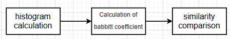
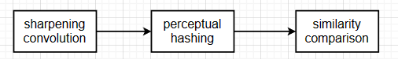
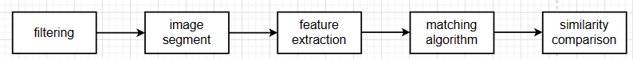
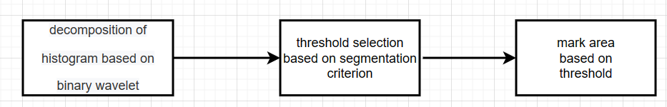
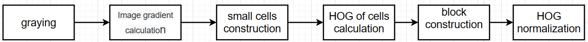

<h1 align = "center">Project Proposal</h1>

张旭东 12011923

## 1. Background

​	Face matching technology is the process of comparing the face images detected in the static image or videos with the face images in the database to find out the matched faces, so as to achieve the purpose of identity recognition and identification. It is a subject in the fields of biometrics and artificial intelligence. Face matching is one of the most successful applications of image analysis and understanding. Because of its wide application in the business, security, identity authentication, law enforcement and many other aspects, it has been paid more and more attention and gradually become a dynamic research field. In recent years, due to the need of anti-terrorism, homeland security and social security, all countries in the world have increased their investment in the field of security. Identity identification is a core issue of security. Biometrics identification technology provides a simple, easy and reliable method for human identity identification. In these biological features, the face image is the main human characteristics. Compared to other biological features, face image is relatively stable and not easy to be forgotten,changed and stolen. Also, using face images to  identify identity is easy to be accepted by people.

​	In real life, it is necessary to compare the similarity of different images or quickly find similar pictures from a large number of pictures, which requires the corresponding image similarity algorithm to achieve. In addition, moat application scenarios of machine learning and artificial intelligence require the use of image similarity algorithms.

​	Based on the existing face matching technology based on comparison of images' similarity, the project will optimize the performance of the existing method by adding filter denoising, image segmentation and feature extraction by another method to the existing method.

## 2. Existing Research

### 2.1 Classical algorithm of calculating similarity of images

​	There are five classical algorithm of calculating similarity of images, including average hashing, differential hashing, perceptual hashing, histogram of three channels and histogram of single channel.

**Average hashing**

<b>Fig.1 steps of average hashing

​	The step of calculating hashing value is to set the value of the pixel  to $1$ if the original value of the pixel is larger than average value. Otherwise, set the value of the pixel to $0$. The similarity comparison is based on the Hamming distance. Hamming distance is the number of different characters in the corresponding positions of two strings. The smaller the distance, the more similar the two images are. When Hamming distance is equal to $0$, the two images are particular like. When Hamming distance is less than $5$, the two images are very like. When Hamming distance is larger than $10$, the two image are different pictures.

**Differential hashing**  

<b>Fig.2 steps of differential hashing

​	The step of calculating differential value is to set the value of the pixel  to $1$ if the original value of the pixel is larger than that of the next one. Otherwise, set the value of the pixel to $0$. This will generate $7×8$ matrix. The principle of similarity comparison is the same as the above.

**Perceptual hashing**

<b>Fig.3 steps of perceptual hashing

​	The step of calculate DCT matrix is to break the picture down into frequency clusters and ladder shapes, which can reduce the redundancy and relevance of images. DCT, which is discrete cosine transform, is an image compression algorithm that transforms the image from spatial domain to frequency domain. The step of resizing DCT matrix to $8×8$ is to keep the $8×8$ matrix in the upper left corner of matrix, which shows the lowest frequency of the image.

**Comparison of three hashing algorithm**

​	The average hash algorithm is fast, but highly sensitive. A slight change will greatly affect the judgment results, resulting in poor accuracy. However, both average and differential hashing algorithms take less time than perceptual hashing. When the image's brightness, chroma, contrast and sharpness are changed, the performance of average hashing is the best, followed by that of difference hashing, and the worst is the performance of perceptual hashing.

**Histogram of three channels and histogram of single channel**

​	The principle of histogram of three channels is similar to that of single channel.

<b>Fig.4 steps of histogram of three channels and histogram of single channel

​	The formula of calculation of Babbitt coefficient is
$$
\rho (p,p^{,})=\sum^{N}_{i=1} \sqrt{p(i)p^{,}(i)}
$$
​	where $p(i)$ represents the histogram of template and $p^{,}(i)$ represents the histogram of testing.

### 2.2 Classical processing flow of face matching based on comparison of images' similarity

<b>Fig.5 classical processing flow of face matching based on comparison of images' similarity

**Present effect**

<b>Fig.6 Present effect

**Disadvantages**

​	Classical processing flow of face matching based on comparison of images' similarity has some disadvantages. One of the disadvantages is that the noise is not taken into account. Due to the noise, sharpening convolution and similarity comparison of images directly will make the error rate of results relatively high. One method to improve is to add filtering for denoising before sharpening convolution. Another of the disadvantages is that it takes a long time to compare the similarity of the whole image. It's just the faces that need to be compared for similarity. So image segment is used after filtering and before feature extraction.

## 3. Improvement

<b>Fig.7 improvement processing flow of face matching based on comparison of images' similarity

**Filtering**

​	The filter used to filtering is Bilateral filter. Bilateral filter is a nonlinear filtering method that combines spatial proximity and pixel value similarity of images as a compromise and considers spatial information and gray similarity, which can achieve edge preservation and denoising. It has the characteristics of simple, non-iterative and local.

​	The advantage of bilateral filter is that it can make edge preserving, which is helpful for the next step-image segment. Generally, Gaussian filter is used to reduce noise, which will blur the edge obviously, and the protection effect for high-frequency details is not obvious.

<b>Fig.8 the principle of a bilateral filter

​	Bilateral filter consist of two components, including domain component and range component. Domain component is similar to Gaussian lowpass filter(`Formula (2)`), which is used to reduce noise. Range component is used to preserve edge(`Formula(3)`).
$$
d(i,j,k,l)=e^{-\frac{(i-k)^{2}+(j-l)^{2}}{2\sigma_{d}^{2}}}
$$

$$
r(i,j,k,l)=e^{-\frac{||f(i,j)-f(k,l)||^{2}}{2\sigma_{r}^{2}}}
$$

​	The formula of output is
$$
g(i,j)=\frac{\sum_{k,l}f(k,l)w(i,j,k,l)}{\sum_{k,l}w(i,j,k,l)}\\
w(i,j,k,l)=e^{-\frac{(i-k)^{2}+(j-l)^{2}}{2\sigma_{d}^{2}}--\frac{||f(i,j)-f(k,l)||^{2}}{2\sigma_{r}^{2}}}
$$
**Image segment**

​	The method used in image segment is threshold segmentation based on wavelet transform. Wavelet transform is a mathematical tool widely used in recent years. Compared with Fourier transform and window Fourier transform, wavelet transform is a local transform of space (time) and frequency, which can effectively extract information from signals. Moreover, wavelet transform has multi-scale characteristics and can analyze signals at different scales, so it has been applied in image segmentation.

<b>Fig.9 steps of threshold segmentation based on wavelet transform

**Feature extraction**

​	The method used in feature extraction is Histogram of Oriented Gradient (HOG). The feature of the Histogram of Oriented Gradient (HOG) is a feature descriptor used to detect objects in computer vision and image processing. It constructs features by calculating and counting the gradient direction histogram of the local area of the image. HOG is operated on the local grid unit of an image, so it can maintain a good invariance to the geometric and optical deformation of the image, which can only appear in a larger space field.

<b>Fig.10 steps of HOG

**Matching algorithm**

​	The method used in matching algorithm is  perceptual hashing. Correlation principle have been introduced above.

**Expected effect**

​	Compared with classical processing , accuracy of improved processing is expected to be higher than that of classical processing. What's more, its performance is also relatively stable when the noise of testing image is large. Besides, the time required to test an image should not be too long, preferably within 10 seconds.

## 4. Main Challenges

**Template image**

​	As we all know, the ideal template picture is the one on our ID card because it is used as a standard in real life. However, it is not realistic to collect the images on ID card. So we have to choose a clear, less noisy image as the template image.

**Data sets of testing**

​	Data sets of several faces need to be collected, which include noisy images and images of the face partially obscured. Maybe it will takes a long time to search.

## 5. Time schedule 

- 10-11 week: reoccurrence classical processing 
- 11-13 week: construct improved processing flow
- 14-15 week: test data sets and do performance evaluation and analysis

## Reference

[1] Y. Tao, X. Huang and X. Ma, "Research on Face Matching Algorithms for Smart Classrooms," 2021 IEEE 3rd International Conference on Computer Science and Educational Informatization (CSEI), Xinxiang, China, 2021, pp. 1-6, doi: 10.1109/CSEI51395.2021.9477713.

[2] W. C. Chan, M. V. Le and P. D. Le, "A wavelet and Canny based image comparison," IEEE Conference on Cybernetics and Intelligent Systems, 2004., Singapore, 2004, pp. 329-333 vol.1, doi: 10.1109/ICCIS.2004.1460435.

[3] V. S. Manikanta and K. Karthik, "Image similarity based on eigen-correspondences," 2013 Annual IEEE India Conference (INDICON), Mumbai, India, 2013, pp. 1-6, doi: 10.1109/INDCON.2013.6726067.