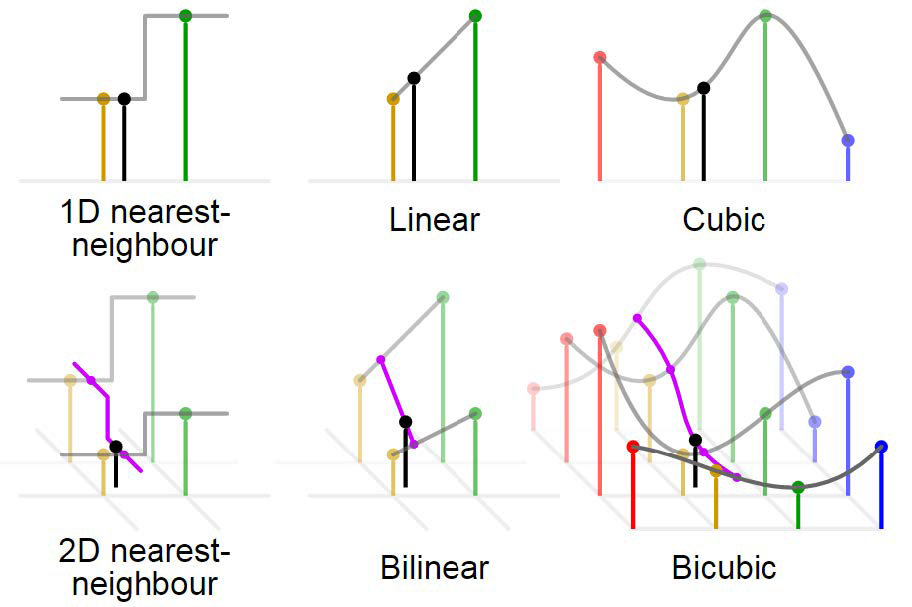
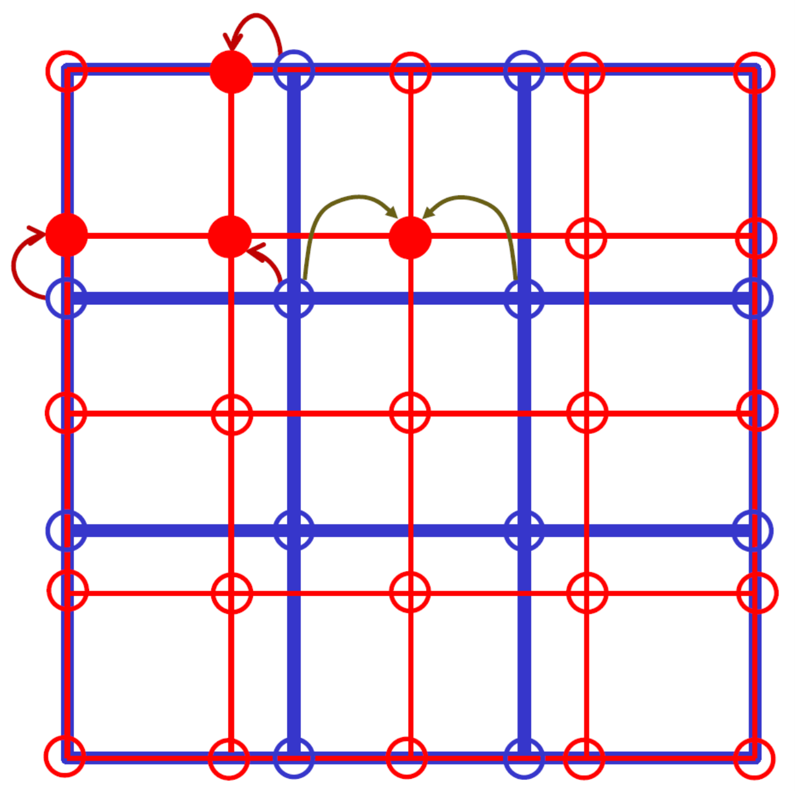
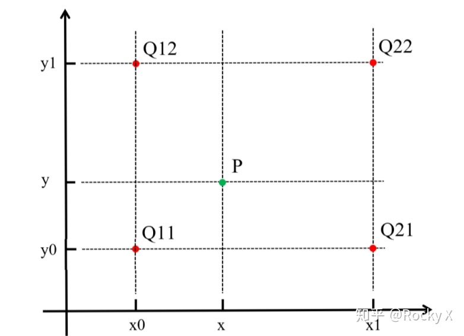
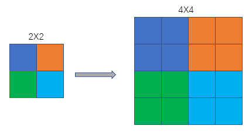
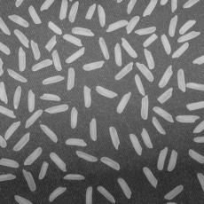
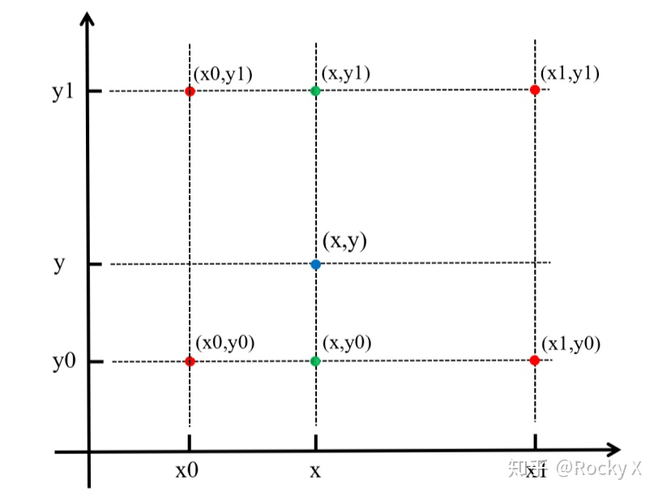
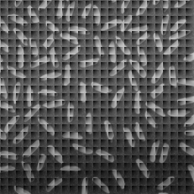
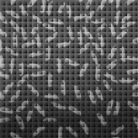
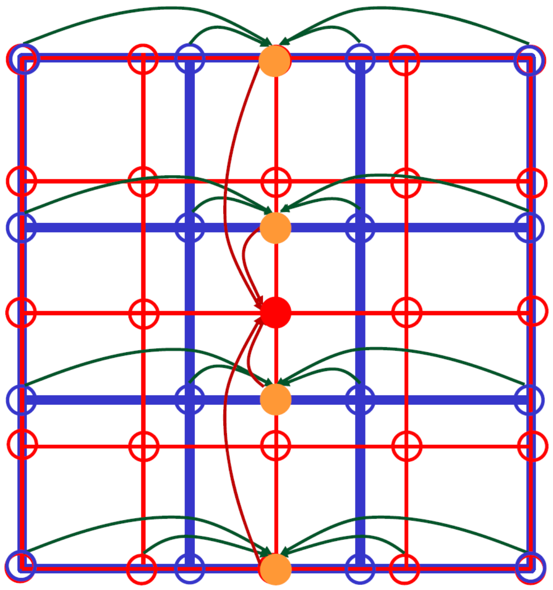

# interpolation_11911521

<center>11911521钟新宇

## Introduction

In digital image processing, in order to interpolate (scale) an image to a specified resolution, we need to adopt some interpolation strategies to perform the calculation of the color at the corresponding position after scaling. The principle of interpolation scaling is based on the points in the target resolution, corresponding them to the source image according to the scaling relationship, finding the points (not necessarily whole pixel points) in the source image, and then interpolating them by the relevant points in the source image to get the target points.



In this experiment, I learned and used python to implement the nearest neighbor interpolation method, bilinear interpolation method and bicubic interpolation method, and compared the advantages and disadvantages of these three methods. Through this experiment, I also enhanced my python programming skills.

## Process

### Nearest Neighbor Interpolation Method

#### Algorithm

Nearest neighbor interpolation, also known as zero-order interpolation, is a simple multidimensional interpolation method. The key algorithm of nearest neighbor interpolation is to adapt the value of the point closest to the output matrix in the input image without considering the values of neighboring points.



The above figure clearly demonstrates the principle of nearest neighbor interpolation. When we want to enlarge a 4\*4 image into a 5\*5 image, we can consider finding the pixel value of the most adjacent integer coordinate point as the pixel value of the point after the point in the target image, corresponding to the original image, is output.



Thus, we can derive the coordinate conversion equation
$$
src_{x}=tag_{x}\cdot \frac{src_{width}}{tag_{width}} \\
src_{y}=tag_{y}\cdot \frac{src_{height}}{tag_{height}}
$$
For example, a 2\*2 image scaled up to a 4\*4 image.



#### Code

````python
import numpy as np
import cv2 as cv


def nearest_11911521(input_file, dim):
    src_img = cv.imread(input_file, cv.IMREAD_GRAYSCALE)
    src_h, src_w = src_img.shape
    tag_h, tag_w = int(dim[0]), int(dim[1])
    tag_img = np.zeros((tag_h, tag_w))
    factor_y, factor_x = (src_h - 1) / (tag_h - 1), (src_w - 1) / (tag_w - 1)

    for i in range(tag_h):
        for j in range(tag_w):
            src_y = int(round(i * factor_y))
            src_x = int(round(j * factor_x))
            tag_img[i][j] = src_img[src_y][src_x]
    return tag_img


if __name__ == '__main__':
    path = 'rice.tif'
    dim = [256 * 1.1, 256 * 1.1]
    newfile1 = nearest_11911521(path, dim)
    cv.imwrite('enlarged_nearest_11911521.tif', newfile1)
    cv.imwrite('enlarged_nearest_11911521.png', newfile1)

    path = 'rice.tif'
    dim = [256 * 0.9, 256 * 0.9]
    newfile2 = nearest_11911521(path, dim)
    cv.imwrite('shrunk_nearest_11911521.tif', newfile2)
    cv.imwrite('shrunk_nearest_11911521.png', newfile2)

````


#### Result

- Zoom in to 1.1x
    - 
- Reduced to 0.9x
    - 

###  Bilinear interpolation method 

#### Algorithm

Bilinear interpolation is a generalization of linear interpolation in two dimensions, and a total of three linear interpolations are done in two directions. A hyperbolic paraboloid is defined to be fitted to four known points.

This is done by performing two linear interpolation calculations in the X-direction, followed by one interpolation calculation in the Y-direction. The following figure shows.



In order to determine the color of a pixel point in the target image, we can select four points around this point in the original image and perform linear interpolation in the x-direction and y-direction for each of these four points.
$$
\begin{aligned}
&f\left(x, y_{1}\right)=\frac{x_{2}-x}{x_{2}-x_{1}} f\left(Q_{11}\right)+\frac{x-x 1}{x_{2}-x_{1}} f\left(Q_{21}\right) \\
&f\left(x, y_{2}\right)=\frac{x_{2}-x}{x_{2}-x_{1}} f\left(Q_{12}\right)+\frac{x-x 1}{x_{2}-x_{1}} f\left(Q_{22}\right)
\end{aligned}
$$

$$
f(x, y)=\frac{y_{2}-y}{y_{2}-y_{1}} f\left(x, y_{1}\right)+\frac{y-y_{1}}{y_{2}-y_{1}} f\left(x, y_{2}\right)
$$

Simplifying the formula further, we can obtain:
$$
\begin{aligned}
f(x, y)=f(P) \approx & {[f(Q 11)(x 2-x)(y 2-y)+f(Q 21)(x-x 1)(y 2-y)}+f(Q 12)(x 2-x)(y-y 1)+f(Q 22)(x-x 1)(y-y 1)]
\end{aligned}
$$


#### Code

````python
import numpy as np
import cv2 as cv


def bilinear_11911521(input_file, dim):
    src_img = cv.imread(input_file, cv.IMREAD_GRAYSCALE)
    src_h, src_w = src_img.shape
    tag_h, tag_w = int(dim[0]), int(dim[1])
    tag_img = np.zeros((tag_h, tag_w))
    factor_y, factor_x = (src_h - 1) / (tag_h - 1), (src_w - 1) / (tag_w - 1)

    for i in range(tag_h):
        for j in range(tag_w):
            src_y = i * factor_y
            src_x = j * factor_x

            y1 = int(np.floor(src_y))
            y2 = int(np.ceil(src_y))
            x1 = int(np.floor(src_x))
            x2 = int(np.ceil(src_x))

            diff_y = src_y - y1
            diff_x = src_x - x1

            weight = [(1 - diff_y) * (1 - diff_x), diff_y * (1 - diff_x), (1 - diff_y) * diff_x, diff_y * diff_x]
            q = [src_img[y1][x1], src_img[y2][x1], src_img[y1][x2], src_img[y2][x2]]
            for k in range(0, 3):
                tag_img[i][j] += round(weight[k] * q[k])

    return tag_img


if __name__ == '__main__':
    path = 'rice.tif'
    dim = [256 * 1.1, 256 * 1.1]
    newfile1 = bilinear_11911521(path, dim)
    cv.imwrite('enlarged_bilinear_11911521.tif', newfile1)
    cv.imwrite('enlarged_bilinear_11911521.png', newfile1)

    path = 'rice.tif'
    dim = [256 * 0.9, 256 * 0.9]
    newfile2 = bilinear_11911521(path, dim)
    cv.imwrite('shrunk_bilinear_11911521.tif', newfile2)
    cv.imwrite('shrunk_bilinear_11911521.png', newfile2)

````


#### Result

- Zoom in to 1.1x
    - 
- Reduced to 0.9x
    - 

###  Bicubic interpolation method

#### Algorithm

Dual cubic interpolation is also known as cubic convolutional interpolation. Cubic convolutional interpolation is a more complex interpolation method. The algorithm uses the grayscale values of 16 points around the point to be sampled for cubic interpolation, taking into account not only the grayscale effect of the four directly adjacent points, but also the effect of the rate of change of grayscale values between the neighboring points. The triple operation can obtain a magnification effect closer to the high-resolution image, but it also leads to a sharp increase in the amount of operations.



In this experiment, I used the interp2d package for interpolation.

#### Code

````python
import numpy as np
import cv2 as cv
from scipy.interpolate import interp2d


def bicubic_11911521(input_file, dim):
    src_img = cv.imread(input_file, cv.IMREAD_GRAYSCALE)
    src_h, src_w = src_img.shape
    tag_h, tag_w = int(dim[0]), int(dim[1])

    interpolator = interp2d(range(src_h), range(src_w), src_img, kind='cubic')
    tag_y = np.linspace(0, src_h - 1, num=tag_h)
    tag_x = np.linspace(0, src_w - 1, num=tag_w)
    tag_img = interpolator(tag_y, tag_x)

    return tag_img


if __name__ == '__main__':
    path = 'rice.tif'
    dim = [256 * 1.1, 256 * 1.1]
    newfile1 = bicubic_11911521(path, dim)
    cv.imwrite('enlarged_bicubic_11911521.tif', newfile1)
    cv.imwrite('enlarged_bicubic_11911521.png', newfile1)

    path = 'rice.tif'
    dim = [256 * 0.9, 256 * 0.9]
    newfile2 = bicubic_11911521(path, dim)
    cv.imwrite('shrunk_bicubic_11911521.tif', newfile2)
    cv.imwrite('shrunk_bicubic_11911521.png', newfile2)

````


#### Result

- Zoom in to 1.1x
    - 
- Reduced to 0.9x
    - 

### Comparison

We can observe that all three interpolation methods are able to perform scaling operations on the image, but the results of the image processing are different.

- The advantage of the nearest neighbor interpolation method is that the computational effort is small and the algorithm is simple, so the operation is faster. However, it only uses the gray value of the pixel closest to the sampling point to be measured as the gray value of that sampling point, without considering the influence of other neighboring pixels, so there is an obvious discontinuity in the gray value after resampling, and the image quality loses more, resulting in obvious mosaic and jaggedness.    
- The bilinear interpolation method works better than the nearest neighbor interpolation. The hesitant bilinear interpolation method takes into account the influence of the four neighboring points around the sampled point on the point, so the gray value of the interpolated image is more continuous, but the image edges become more blurred.
- The bicubic interpolation algorithm is the most complex, which considers not only the influence of four neighboring pixel points on the gray value of the sampled point, but also the influence of the rate of change of the gray value, so it can produce smoother edges with the best results.

## Summary

In this experiment, I learned and used python to implement the nearest neighbor interpolation method, bilinear interpolation method and bicubic interpolation method, and compared the advantages and disadvantages of these three methods.

Through this experiment, I also enhanced my python programming skills. In the process of completing the experiment, I became familiar with the use of relevant functions in numpy and opencv toolkits, and encountered programming problems such as file reading, file writing, array crossing, and format conversion, which I eventually solved with the help of the Internet.